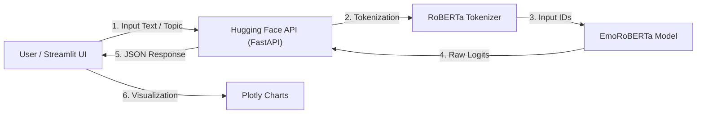

## 🧠 EmoSense: The Unified Emotion Monitor

**EmoSense** is a state-of-the-art NLP pipeline designed to decode the complexity of human emotion in text. Unlike traditional sentiment analysis (which only detects "Positive" or "Negative"), EmoSense utilizes a fine-tuned **RoBERTa** model to simultaneously predict:
1.  **Emotion Category** (12 classes including Joy, Fear, Anger, Gratitude, etc.)
2.  **Emotion Intensity** (A regression score of how strong the feeling is)
3.  **Sarcasm Detection** (Identifying if the literal meaning contradicts the sentiment)

*(Screenshot of the EmoSense Live Dashboard)*

---

## 🚀 Live Demo

Experience the power of the Unified Emotion Monitor live on Streamlit Cloud:

### 👉 [Click Here to Launch App](https://srkreddy-emosense.streamlit.app/)

---

## 🌟 Key Features

* **Unified Multi-Task Learning:** A single model pass handles classification (Emotion), regression (Intensity), and binary classification (Sarcasm).
* **Real-Time X (Twitter) Analysis:** Integrated with the X API v2 to fetch live tweets on any trending topic and analyze public sentiment instantly.
* **Deep Learning Backend:** Powered by a custom `RoBERTa-base` architecture hosted on Hugging Face Spaces for 24/7 availability.
* **Interactive Visualizations:** Rich, interactive charts built with Plotly to visualize confidence scores and intensity distributions.
* **Explainable Metrics:** Provides detailed breakdowns of confidence scores for all 12 supported emotions.

---

## 🏗️ Architecture

The project follows a decoupled Microservices architecture to ensure scalability and ease of deployment.

# Supported Emotions: 
Positive:Joy, Love, Gratitude, Approval, CaringAnger

Negative:Sadness, Fear, Disgust

Ambiguous:RemorseCuriosity, Confusion

Neural🛠️ Tech StackFrontend: Streamlit, Plotly Express, PandasBackend API: FastAPI, Uvicorn, Python 3.9

Machine Learning: PyTorch, Hugging Face 

TransformersModel: RoBERTa (Robustly Optimized BERT Pretraining Approach)

Data Source: Tweepy (X/Twitter API v2)

Deployment: Docker (HF Spaces) & Streamlit Community Cloud

#📂 Project StructurePlaintextEmoSense-Project/

├── app.py                  # 🖥️ Main Streamlit Application (Frontend)

├── requirements.txt        # 📦 Python dependencies for the UI

├── README.md               # 📄 Project Documentation

├── assets/                 # 📸 Images and screenshots

│   └── ui_screenshot.png

└── notebooks/              # 📓 Research & Training work

   ├── ML_Hackathon.ipynb  # Model training pipeline (PyTorch)

   └── Api_gen.ipynb       # API development notebook
    
(Note: The Backend API code is deployed separately to Hugging Face Spaces via Docker.)

#💻 How to Run LocallyFollow these steps to set up the project on your local machine.

1. Clone the RepositoryBashgit clone [https://github.com/SRKR6115/EmoSense.git](https://github.com/SRKR6115/EmoSense.git)
cd EmoSense-UI
2. Install DependenciesIt is recommended to create a virtual environment first.Bashpip install -r requirements.txt
3. Configure API TokensTo use the Live Topic Analysis feature, you need an X (Twitter) Bearer Token.Open app.py.Find the variable X_BEARER_TOKEN.Replace the placeholder with your own Bearer Token from the X Developer Portal.
4. Run the ApplicationBashstreamlit run app.py
 
The app will open automatically in your browser at http://localhost:8501.

#🧠 Model Training Details: The core of EmoSense is a Multi-Head RoBERTa model.

Dataset: Trained on a curated dataset of over 50,000 labeled tweets.

Training Infrastructure: Trained on NVIDIA T4 GPUs via Kaggle Kernels.

Performance: Achieved significantly higher accuracy than standard BERT-base models on sarcasm detection due to RoBERTa's dynamic masking capabilities.

#🔮 Future Roadmap :
Multilingual Support: Extending the tokenizer to support Hindi and Spanish.[ ]
Historical Analysis: Tracking emotion trends on a topic over 24 hours.[ ]
LLM Integration: Using Llama-2 to generate textual summaries of the emotional analysis.

#✍️ Author

**SRKREDDY**

GitHub: Krish6115

[LinkedIn](https://www.linkedin.com/in/siva-rama-krishna-reddy-padala/)

Built with ❤️ By Krish :)

